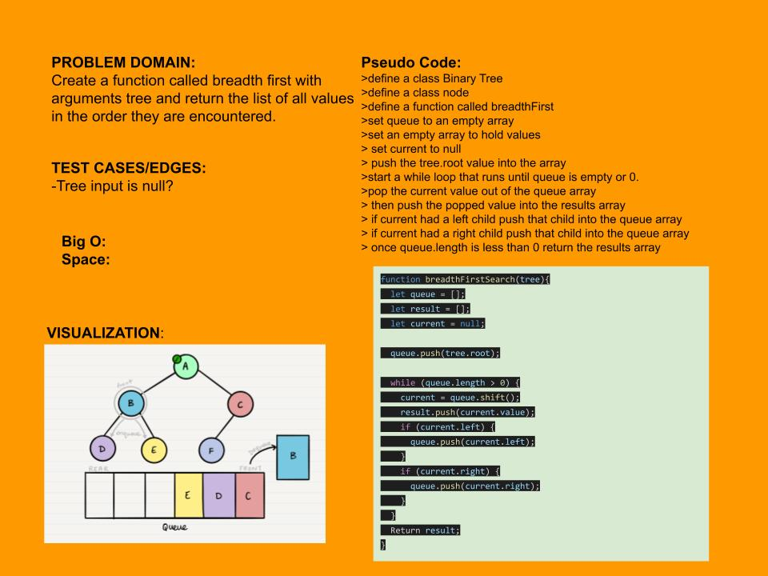

#Breadth-First Traversal

### Challenge Summary

-  Write a function called breadth first
     - Arguments: tree
     - Return: list of all values in the tree, in the order they were encountered
### Approach & Efficiency

- There is queue like behaviour but using an array seemed so much easier. 

- Add all node values at each level starting from root to an array then return that array

### Whiteboard Process
