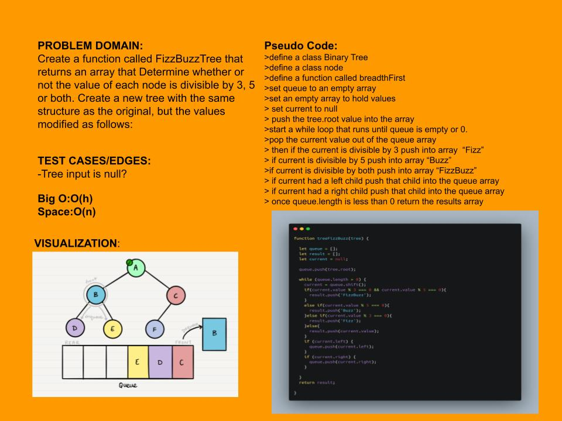

# Challenge Summary
Fizz Buzz my tree!!!!!
  - For a node value in the tree that is divisible by either 3 or 5 or both returns the FizzBuzz conditions.
    - divisible by 3 is Fizz
    - divisible by 3 is Fizz
    - divisible by 3 and 5  is FizzBuzz

## Approach & Efficiency
Before Meetup: 
brute force method of traversing the array with breadth first then identifying the current if it is divisible by 3, 5 or both and adding to an array like that. 

## Solution
traverse breadth first and store data in an array

## Whiteboard Process
